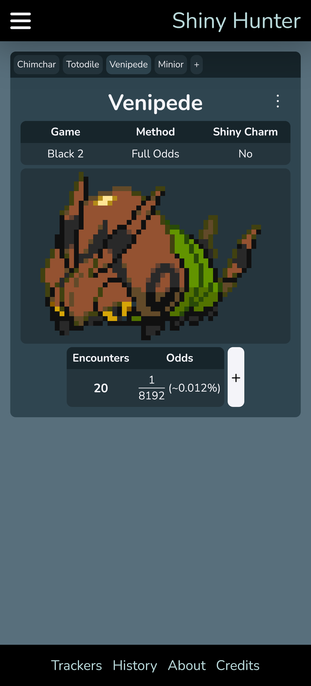
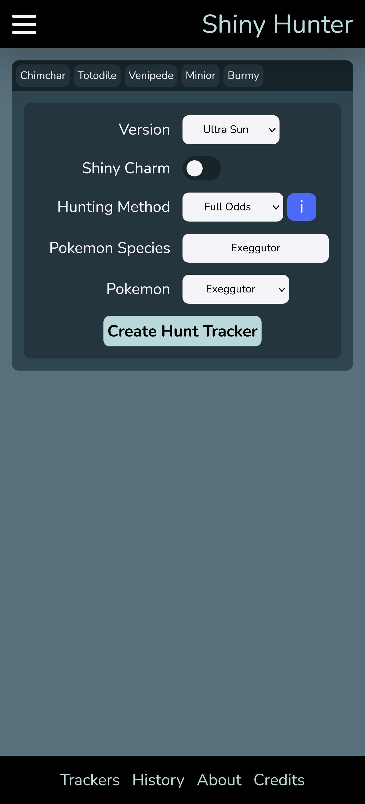
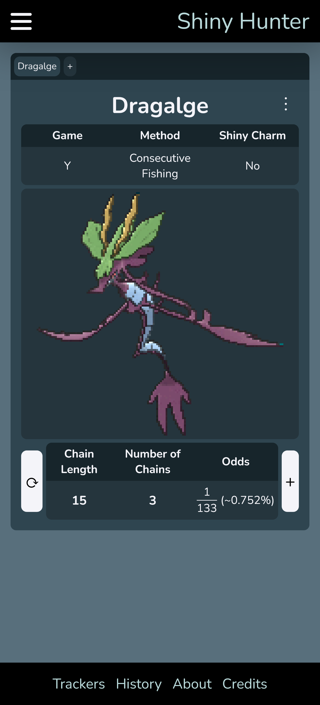
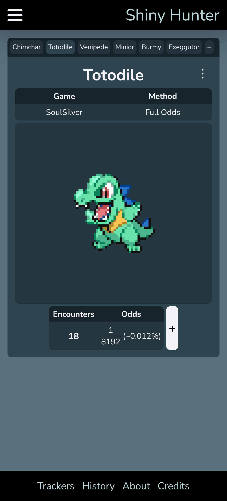
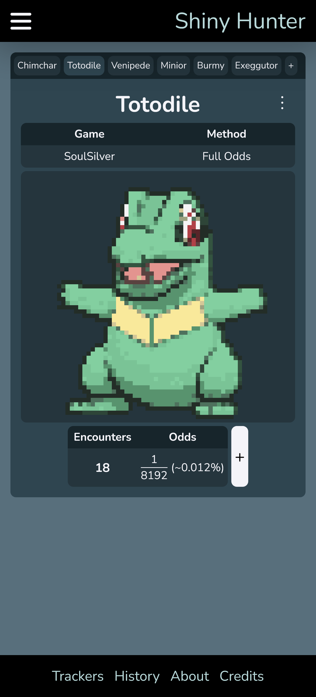
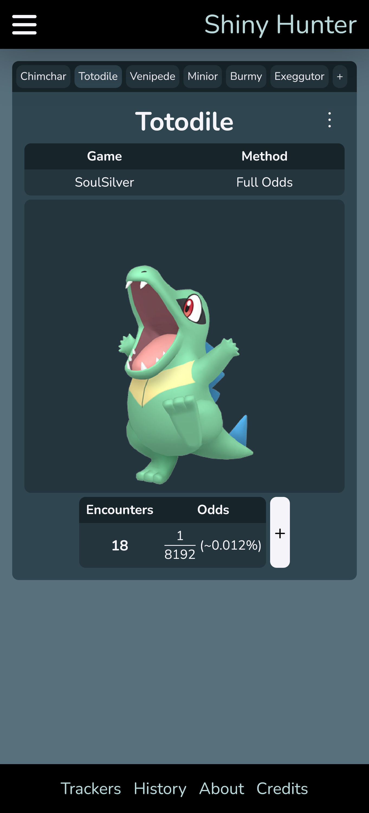
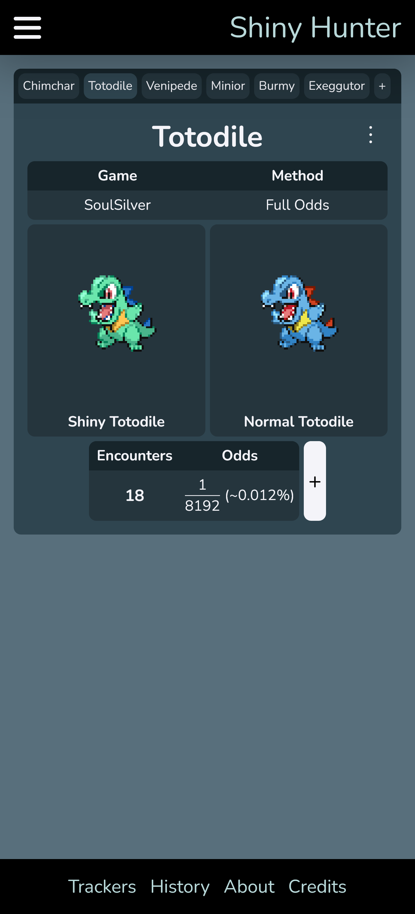
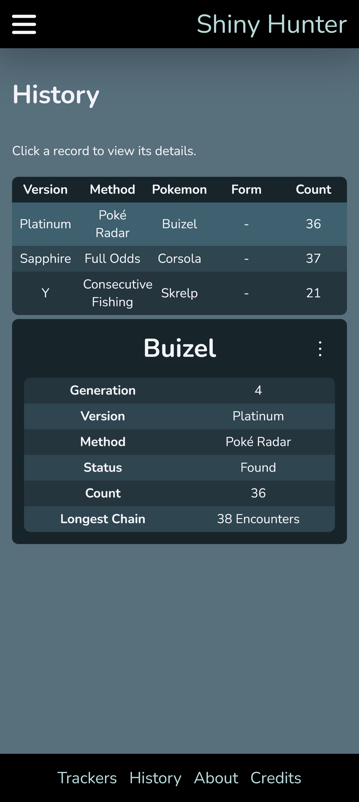

# Shiny Hunter

Shiny Hunter is a progressive web application built for hunting shiny Pokémon. This project is maintained out of personal interest, and new features/fixes will be delivered whenever I see fit. However, please feel free to make feature requests or report issues!

# Features

## Tabbed Interface

At its core, Shiny Hunter provides an easy way to keep track of multiple shiny hunts. The main page features a tabbed interface where users can switch between different shiny hunts.

## Specify Hunt Details

Shiny Hunter is built to hunt for a wide array of Pokémon and provides a high level of specificity for what you're hunting, including different varieties, forms, and genders.

## Tailored Controls

The many different ways to hunt shiny Pokémon requires a different way to keep track of a shiny hunt between each method.
Shiny Hunter provides controls tailored to each method in order to provide useful and accurate data of your shiny hunt.

## Customizable Visuals

Shiny Hunter provides a couple of options to customize what sprites you see while hunting for shiny Pokémon.

### Sprite Sources

The application can display of one of three different sources for the sprite of the Pokémon you're hunting:

1. The original sprite from that generation

2. The model used for Pokémon Showdown

3. The image used for Pokémon home

### Normal Sprites

Some shiny Pokémon may be hard to distinguish from their normal counterparts. In this case, you can enable "Show Normal Sprites" to view a side-by-side comparison of the shiny sprite and normal sprite.

## Hunt History

Shiny Hunter keeps track of previously completed shiny hunts that you can view at any time.

## Full Application

As a progressive web application, Shiny Hunter provides many of the same benefits as a native application for mobile devices and web browsers alike.

1. Shiny Hunter can be installed from your web browser as a native application on your mobile device
2. Shiny Hunter will continue to work if you go offline
3. No accounts are needed to use this service, as all data is stored locally in your device's browser

## Accessibility

A large amount of effort was put into making Shiny Hunter as accessible as possible; in particular, full keyboard navigation is supported using the industry standards for design and functionality.
